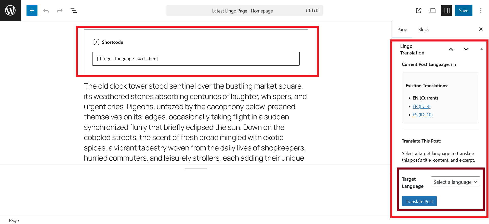

# Lingo WP Translator

WordPress plugin to perform automatic translations by integrating [Lingo.dev PHP SDK](https://github.com/lingodotdev/sdk-php)

## Installation and Setup

### Installation

To install this plugin, simply navigate to your WordPress plugin directory (wordpress/wp-content/plugins by default) and clone this repo into it.

Alternatively, you can download this repo as a zip file and upload the extracted content to the same location as above.

After completing the above step, navigate to the folder and install the [Lingo.dev PHP SDK](https://github.com/lingodotdev/sdk-php) with Composer:

```bash
$ cd lingo-wp-translator

$ composer require lingodotdev/sdk
```

### Setup

1. After installation, navigate to the plugin section in your WordPress admin panel to find `Lingo WP Translator` and activate it.

2. In the WP admin, navigate to **settings>Lingo Translation Settings**

3. Add your [Lingo.dev](https://lingo.dev/) API key in the API key section
4. Next, add a source language and the target languages you wish to translate to.
5. Find the **Test String Translation** in the **Lingo Translation Settings** page to test if your configuration works. Simply put in your desired text, select a target language and click on **Translate String** to see the result.

**NOTE**: You can optionally select the `fast mode` to make translations faster, at the expense of accuracy.

## Usage

This plugin allows you to translate posts and pages in WordPress. Follow these steps to learn how to use it:

1. In your WordPress admin page, create a new page or post.
2. Next, in your edit screen, add this shortcode:
   ```text
   [lingo_language_switcher]
   ```
   This will provide a simple language switcher to allow users switch between languages they prefer.
3. Next write your preferred content.
4. On the right pane, you will find a meta box called **Lingo Translation**. Scroll to find the **Translate This Post** section.
5. Select your target language and click the **Translate Post** button.
6. Once your post is translated, you will see a link to view the translation and edit it if you want to.



**NOTE**: You still need to publish your translated content for users to find it on your wordpress site.
